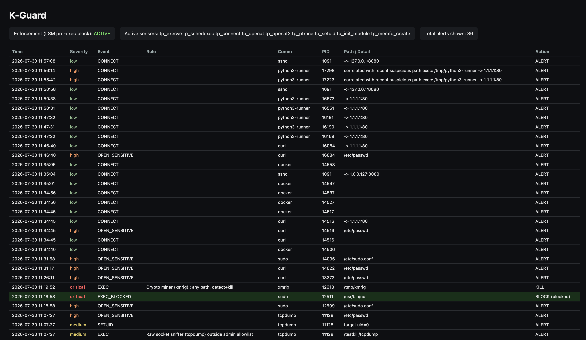
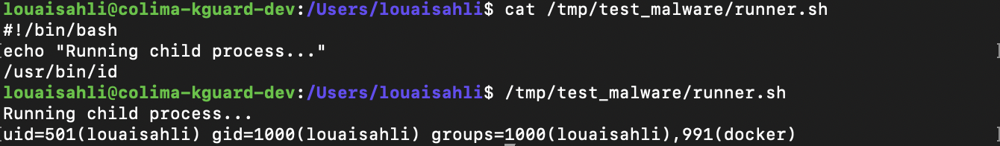
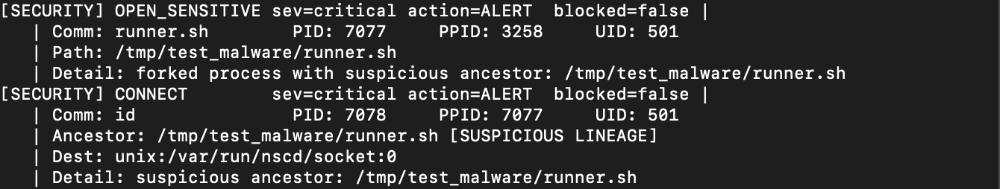
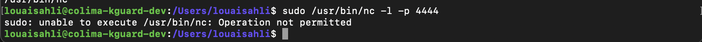
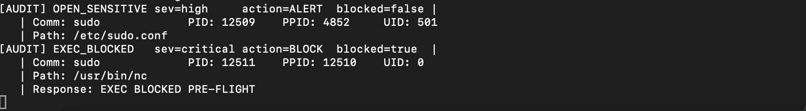
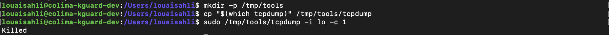
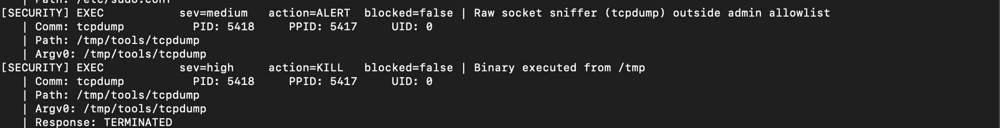
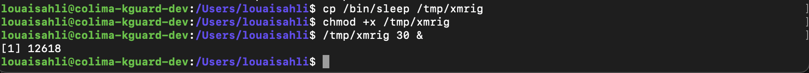
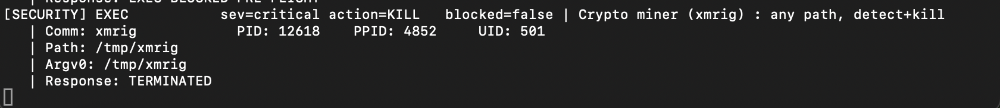

# K-Guard Demo

K-Guard is a host-based intrusion prevention system built on eBPF: tracepoint sensors for
detection, and an LSM (`bprm_check_security`) hook for real pre-exec prevention. This walks
through a few live scenarios, from harmless-looking to actively malicious, showing what
K-Guard sees and does at each stage.

---

## 1. Dashboard overview

The built-in web dashboard (`sinks.dashboard_listen_addr` in config) shows live sensor status,
whether LSM enforcement is active, and a scrollable history of every alert K-Guard has fired.



Enforcement is `ACTIVE` here : the LSM pre-exec block hook attached successfully, so K-Guard
isn't just detecting-and-killing, it's actually preventing execution for anything on the
block-list.

---

## 2. Suspicious-path exec + connect correlation

**Scenario:** A script or binary executing from a suspicious directory (e.g., `/tmp/test_malware/runner.sh`) spawns child processes (e.g., `/usr/bin/id`) that perform file access or network connections. Even if the child executable itself is a standard system tool, its origin under a suspicious process tree indicates malicious activity.

```bash
cat /tmp/test_malware/runner.sh
chmod +x /tmp/test_malware/runner.sh
/tmp/test_malware/runner.sh
```



Instead of relying on userspace time windows, K-Guard tracks process trees directly in eBPF kernel maps. When `runner.sh` (PID 7077) executes from `/tmp`, eBPF flags its process context. When its child process `id` (PID 7078) attempts a connection or file access, eBPF resolves the parent lineage, tags the alert with `[SUSPICIOUS LINEAGE]`, and escalates severity from `low` to `critical`:



---

## 3. Pre-exec block: `nc`

**Scenario:** an attempt to launch `nc` (netcat) : commonly used for reverse shells/listeners 
where the exact path is on K-Guard's LSM block-list.

```bash
sudo /usr/bin/nc -l -p 4444
```



Because `/usr/bin/nc` is synced into the in-kernel `blocked_paths` map, the LSM hook denies the
`execve()` outright, the binary never runs at all, not even for a moment:



Note the alert type: `EXEC_BLOCKED`, not `KILL`, there's no process to kill, since it was never
allowed to start.

---

## 4. Detect-and-kill fallback: `tcpdump` from `/tmp`

**Scenario:** a raw-socket sniffer, copied to `/tmp` and run outside the trusted admin
allowlist, this rule isn't on the exact-path LSM block-list, so it's caught by the tracepoint
sensor path instead (post-exec) and killed as a fallback response.

```bash
mkdir -p /tmp/tools
cp "$(which tcpdump)" /tmp/tools/tcpdump
sudo /tmp/tools/tcpdump -i lo -c 1
```



K-Guard fires two alerts here: first a medium-severity `ALERT` for running a raw-socket tool
outside the allowlist, then a high-severity `KILL` for executing from a suspicious path and
the process is terminated (`Killed`, visible in the shell output above):



---

## 5. Crypto miner detection: `xmrig`

**Scenario:** a binary named after a known cryptominer (`xmrig`), regardless of where it's
placed, this rule matches on basename/pattern with no suspicious-path requirement, since
miner binaries are unwanted anywhere on the host.

```bash
cp /bin/sleep /tmp/xmrig
chmod +x /tmp/xmrig
/tmp/xmrig 30 &
```



K-Guard matches the rule immediately and sends `SIGKILL`:



---

## Summary

| Scenario | Detection path | Response |
|---|---|---|
| `/tmp` exec -> outbound connect | Tracepoint + correlator | `ALERT` (escalated severity) |
| `nc` (exact-path block rule) | LSM pre-exec hook | `BLOCK` : never executes |
| `tcpdump` from `/tmp` | Tracepoint (post-exec) | `ALERT` then `KILL` |
| `xmrig` (any path) | Tracepoint (post-exec) | `KILL` |

The block-vs-kill distinction is the core design point of K-Guard: exact-path rules get synced
into the kernel and are prevented before they ever run, while everything else (substring/prefix
rules, basename rules like the miner match above) is caught immediately after the fact via the
tracepoint sensors and a best-effort kill.